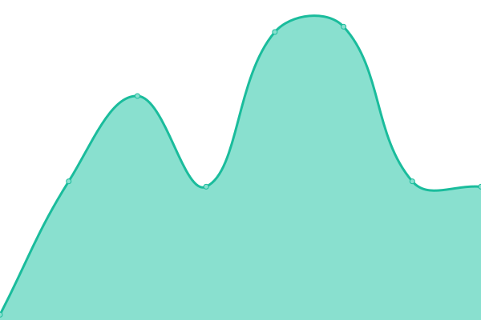

# [📈 Live Status](https://minhh2792.github.io/uptime): <!--live status--> **🟧 Partial outage**

<!--start: status pages-->
<!-- This summary is generated by Upptime (https://github.com/upptime/upptime) -->
<!-- Do not edit this manually, your changes will be overwritten -->
<!-- prettier-ignore -->
| URL | Status | History | Response Time | Uptime |
| --- | ------ | ------- | ------------- | ------ |
|  [MineVN Network](minevn.net) | 🟩 Up | [mine-vn-network.yml](https://github.com/minhh2792/uptime/commits/HEAD/history/mine-vn-network.yml) | 

 212ms
     
 | 

<a href="https://minhh2792.github.io/uptime/history/mine-vn-network">100.00%</a>
    

|  [MineVN Maven & Resource Pack](http://app.minevn.net/pack) | 🟥 Down | [mine-vn-maven-and-resource-pack.yml](https://github.com/minhh2792/uptime/commits/HEAD/history/mine-vn-maven-and-resource-pack.yml) | 

 1082ms
     
 | 

<a href="https://minhh2792.github.io/uptime/history/mine-vn-maven-and-resource-pack">99.99%</a>
    

|  [MineVN Website](http://minevn.net) | 🟥 Down | [mine-vn-website.yml](https://github.com/minhh2792/uptime/commits/HEAD/history/mine-vn-website.yml) | 

 794ms
     
 | 

<a href="https://minhh2792.github.io/uptime/history/mine-vn-website">99.99%</a>
    

|  Node 1 (US) | 🟩 Up | [node-1-us.yml](https://github.com/minhh2792/uptime/commits/HEAD/history/node-1-us.yml) | 

 49ms
     
 | 

<a href="https://minhh2792.github.io/uptime/history/node-1-us">100.00%</a>
    

|  Node 2 (Singapore) | 🟩 Up | [node-2-singapore.yml](https://github.com/minhh2792/uptime/commits/HEAD/history/node-2-singapore.yml) | 

 197ms
     
 | 

<a href="https://minhh2792.github.io/uptime/history/node-2-singapore">100.00%</a>
    

|  Node 3 (Vietnam) | 🟩 Up | [node-3-vietnam.yml](https://github.com/minhh2792/uptime/commits/HEAD/history/node-3-vietnam.yml) | 

 0ms
     
 | 

<a href="https://minhh2792.github.io/uptime/history/node-3-vietnam">100.00%</a>
    

|  Pterodactyl Panel | 🟩 Up | [pterodactyl-panel.yml](https://github.com/minhh2792/uptime/commits/HEAD/history/pterodactyl-panel.yml) | 

 0ms
     
 | 

<a href="https://minhh2792.github.io/uptime/history/pterodactyl-panel">100.00%</a>
    

<!--end: status pages-->

[**Visit our status website →**](https://minhh2792.github.io/uptime)

## 📄 License

- Powered by: [Upptime](https://github.com/upptime/upptime)
- Code: [MIT](./LICENSE) © [Minh Nguyen](https://minhh2792.me)
- Data in the `./history` directory: [Open Database License](https://opendatacommons.org/licenses/odbl/1-0/)
