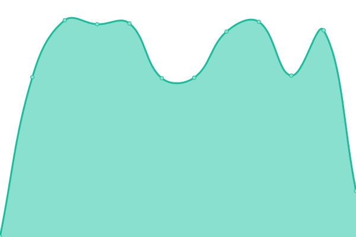

# [📈 Live Status](https://minhh2792.github.io/uptime): <!--live status--> **🟩 All systems operational**

This repository contains the open-source uptime monitor and status page for [Minh Nguyen](https://minhh2792.me), powered by [Upptime](https://github.com/upptime/upptime).

With [Upptime](https://upptime.js.org), you can get your own unlimited and free uptime monitor and status page, powered entirely by a GitHub repository. We use [Issues](https://github.com/minhh2792/uptime/issues) as incident reports, [Actions](https://github.com/minhh2792/uptime/actions) as uptime monitors, and [Pages](https://minhh2792.github.io/uptime) for the status page.

<!--start: status pages-->
<!-- This summary is generated by Upptime (https://github.com/upptime/upptime) -->
<!-- Do not edit this manually, your changes will be overwritten -->
<!-- prettier-ignore -->
| URL | Status | History | Response Time | Uptime |
| --- | ------ | ------- | ------------- | ------ |
|  [MineVN Network](minevn.net) | 🟩 Up | [mine-vn-network.yml](https://github.com/minhh2792/uptime/commits/HEAD/history/mine-vn-network.yml) | 

 218ms
     
 | 

<a href="https://minhh2792.github.io/uptime/history/mine-vn-network">100.00%</a>
    

|  [MineVN Maven & Resource pack](http://app.minevn.net/pack) | 🟩 Up | [mine-vn-maven-and-resource-pack.yml](https://github.com/minhh2792/uptime/commits/HEAD/history/mine-vn-maven-and-resource-pack.yml) | 

 1037ms
     
 | 

<a href="https://minhh2792.github.io/uptime/history/mine-vn-maven-and-resource-pack">100.00%</a>
    

|  [MineVN Website](http://minevn.net) | 🟩 Up | [mine-vn-website.yml](https://github.com/minhh2792/uptime/commits/HEAD/history/mine-vn-website.yml) | 

 698ms
     
 | 

<a href="https://minhh2792.github.io/uptime/history/mine-vn-website">100.00%</a>
    

|  [Kiwi AdguardHome server](https://minhh2792.me) | 🟩 Up | [kiwi-adguard-home-server.yml](https://github.com/minhh2792/uptime/commits/HEAD/history/kiwi-adguard-home-server.yml) | 

 762ms
     
 | 

<a href="https://minhh2792.github.io/uptime/history/kiwi-adguard-home-server">100.00%</a>
    

|  Kiwi Debian server | 🟩 Up | [kiwi-debian-server.yml](https://github.com/minhh2792/uptime/commits/HEAD/history/kiwi-debian-server.yml) | 

 588ms
     
 | 

<a href="https://minhh2792.github.io/uptime/history/kiwi-debian-server">100.00%</a>
    

<!--end: status pages-->

[**Visit our status website →**](https://minhh2792.github.io/uptime)

## 📄 License

- Powered by: [Upptime](https://github.com/upptime/upptime)
- Code: [MIT](./LICENSE) © [Minh Nguyen](https://minhh2792.me)
- Data in the `./history` directory: [Open Database License](https://opendatacommons.org/licenses/odbl/1-0/)
