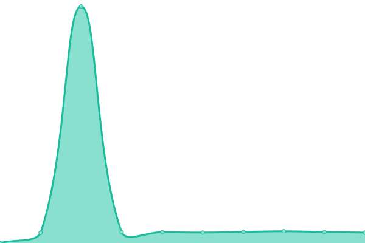
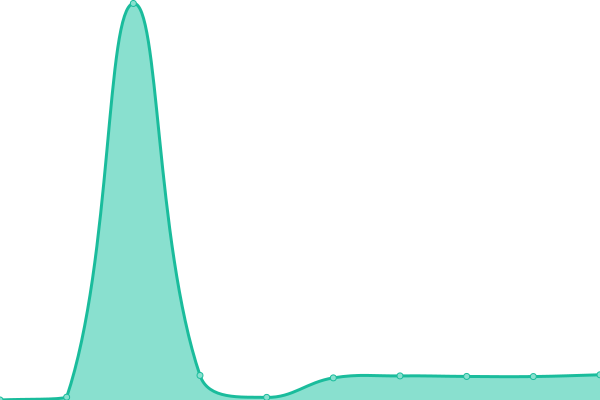
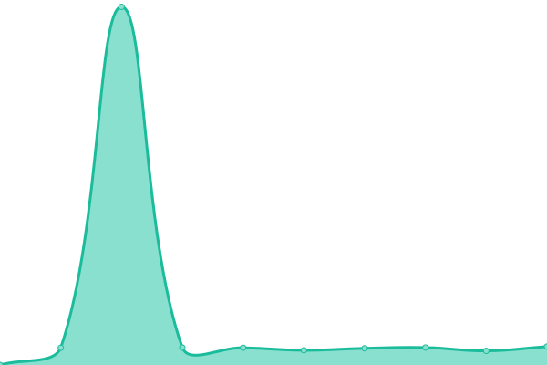
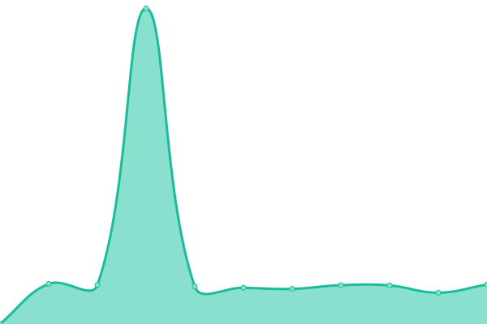

# [📈 Live Status](https://minhh2792.github.io/uptime): <!--live status--> **🟧 Partial outage**

This repository contains the open-source uptime monitor and status page for [Minh Nguyen](https://ayo.so/minhh2792), powered by [Upptime](https://github.com/upptime/upptime).

With [Upptime](https://upptime.js.org), you can get your own unlimited and free uptime monitor and status page, powered entirely by a GitHub repository. We use [Issues](https://github.com/minhh2792/uptime/issues) as incident reports, [Actions](https://github.com/minhh2792/uptime/actions) as uptime monitors, and [Pages](https://minhh2792.github.io/uptime) for the status page.

<!--start: status pages-->
<!-- This summary is generated by Upptime (https://github.com/upptime/upptime) -->
<!-- Do not edit this manually, your changes will be overwritten -->
<!-- prettier-ignore -->
| URL | Status | History | Response Time | Uptime |
| --- | ------ | ------- | ------------- | ------ |
|  [[MineVN Studio] License server](https://license.minevn.net/) | 🟥 Down | [mine-vn-studio-license-server.yml](https://github.com/minhh2792/uptime/commits/HEAD/history/mine-vn-studio-license-server.yml) | 

 122ms
     
 | 

<a href="https://minhh2792.github.io/uptime/history/mine-vn-studio-license-server">0.00%</a>
    

|  [[MineVN] Minecraft](mc.minevn.net) | 🟥 Down | [mine-vn-minecraft.yml](https://github.com/minhh2792/uptime/commits/HEAD/history/mine-vn-minecraft.yml) | 

 0ms
     
 | 

<a href="https://minhh2792.github.io/uptime/history/mine-vn-minecraft">0.00%</a>
    

|  [[MineVN] Maven repo & resource pack server](https://pack.minevn.net) | 🟨 Degraded | [mine-vn-maven-repo-and-resource-pack-server.yml](https://github.com/minhh2792/uptime/commits/HEAD/history/mine-vn-maven-repo-and-resource-pack-server.yml) | 

 3160ms
     
 | 

<a href="https://minhh2792.github.io/uptime/history/mine-vn-maven-repo-and-resource-pack-server">99.34%</a>
    

|  [[MineVN] Website](https://minevn.net) | 🟩 Up | [mine-vn-website.yml](https://github.com/minhh2792/uptime/commits/HEAD/history/mine-vn-website.yml) | 

 3826ms
     
 | 

<a href="https://minhh2792.github.io/uptime/history/mine-vn-website">99.59%</a>
    

|  [[MineVN] Minetrack](https://track.minevn.net) | 🟨 Degraded | [mine-vn-minetrack.yml](https://github.com/minhh2792/uptime/commits/HEAD/history/mine-vn-minetrack.yml) | 

 3207ms
     
 | 

<a href="https://minhh2792.github.io/uptime/history/mine-vn-minetrack">99.36%</a>
    

|  [[MineVN] Grafana](https://grafana.minevn.net) | 🟨 Degraded | [mine-vn-grafana.yml](https://github.com/minhh2792/uptime/commits/HEAD/history/mine-vn-grafana.yml) | 

 4350ms
     
 | 

<a href="https://minhh2792.github.io/uptime/history/mine-vn-grafana">99.37%</a>
    

<!--end: status pages-->

[**Visit our status website →**](https://minhh2792.github.io/uptime)

## 📄 License

- Powered by: [Upptime](https://github.com/upptime/upptime)
- Code: [MIT](./LICENSE) © [Anand Chowdhary](https://anandchowdhary.com), supported by [Pabio](https://pabio.com)
- Data in the `./history` directory: [Open Database License](https://opendatacommons.org/licenses/odbl/1-0/)
